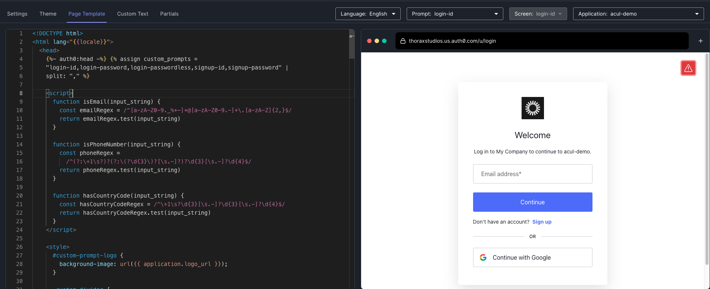

# Connection Switching for Universal Login

## Overview

This is a simple implementation of connection switching. It allows a user to enter an email address or phone number,
then based on what was entered, an email or SMS OTP passwordless flow will start. There is also the option for the
user to choose to continue with a password instead.

## Prerequisites

- You must have a [custom domain](https://auth0.com/docs/customize/custom-domains) configured on your tenant.
- This project requires the [Auth0 CLI](https://github.com/auth0/auth0-cli). Ensure
  that you have logged the CLI into your desired tenant.

```bash
auth0 login
```

## Setup

1. Open the Universal Login Branding Customization Editor

   ```bash
   auth0 ul customize -r standard
   ```

2. Copy the contents of `connection-switching-page-template.html` into the page template.

   

3. Click `Deploy Changes!`

Or, update the page template non-interactively.

```bash
# update the base page template
cat connection-switching-page-template.html | auth0 ul templates update

# update the login-password page partial
auth0 ul customize -r advanced -p "login-password" -s "login-password" -f login-password.json

# update the login-passwordless-email-code page partial
auth0 ul customize -r advanced -p "login-passwordless" -s "login-passwordless-email-code" -f login-passwordless-email-code.json

# update the login-passwordless-sms-otp page partial
auth0 ul customize -r advanced -p "login-passwordless" -s "login-passwordless-sms-otp" -f login-passwordless-sms-otp.json
```
