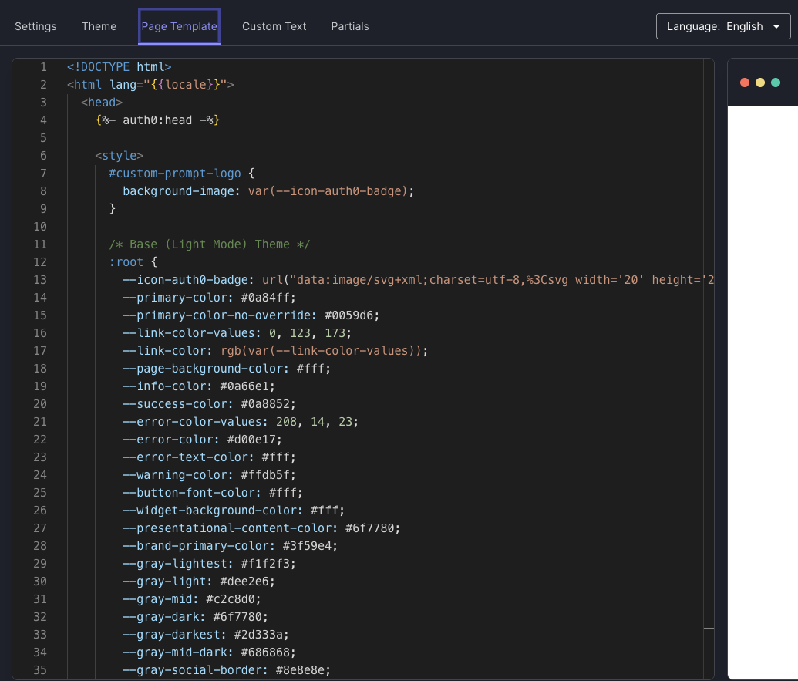
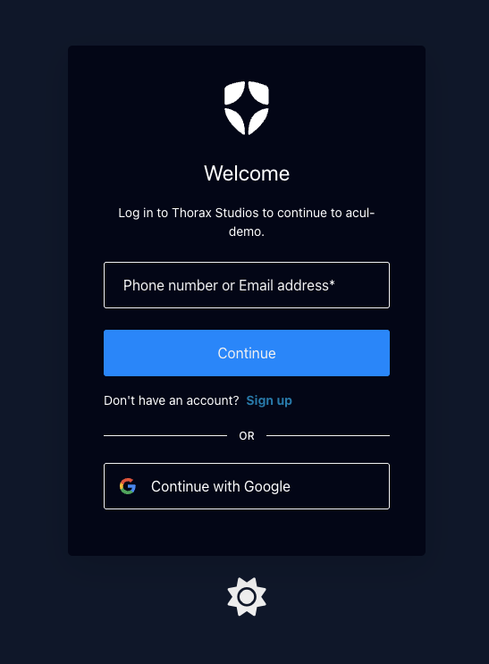
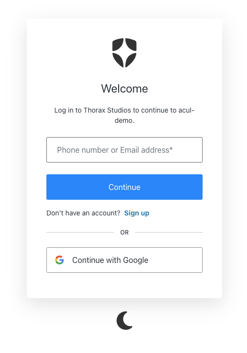

# Dark Mode Support for Universal Login

## Overview

This is a simple workaround implementation of dark mode support for Auth0 Universal Login. Is detects and uses
the user's dark mode preference (if present) and adds a toggle button so the user can switch between light and
dark modes. If the user opts to use the toggle, the last mode used will be saved as a preference.

## Prerequisites

- You must have a [custom domain](https://auth0.com/docs/customize/custom-domains) configured on your tenant.
- This project requires the [Auth0 CLI](https://github.com/auth0/auth0-cli). Ensure
  that you have logged the CLI in to your desired tenant.

```bash
auth0 login
```

## Setup

1. Open the Universal Login Branding Customization Editor

   ```bash
   auth0 ul customize -r standard
   ```

2. Copy the contents of `dark-mode-page-template.html` into the page template.

   

3. Click `Deploy Changes!`

## Screenshots

### Dark Mode



### Light Mode



## Caveats

- There may be a flicker during screen transitions where the page is changed from light to dark.
- This workaround does not work with forms for actions. While the overall dark/light mode coloring works, there are some inconsistencies, such as input field text rendering as white with the input field background color also being white, even though the dark mode CSS specifies otherwise.
