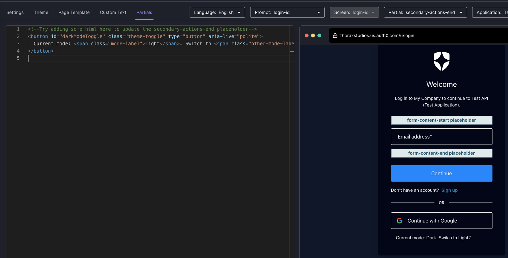

# Dark Mode Support for Universal Login

## Overview

This is a simple workaround implementation of dark mode support for Auth0 Universal Login. Is detects and uses
the user's dark mode preference (if present) and adds a toggle button so the user can switch between light and
dark modes. If the user opts to use the toggle, the last mode used will be saved as a preference.

## Prerequisites

This project requires the [Auth0 CLI](https://github.com/auth0/auth0-cli). Ensure
that you have logged the CLI in to your desired tenant.

```bash
auth0 login
```

## Setup

1. Open the Universal Login Branding Customization Editor

   ```bash
   auth0 ul customize -r standard
   ```

2. Copy the contents of `dark-mode-page-template.html` into the page template.

   

3. Copy the content of `dark-mode-partial.html` and paste it into the partial(s) where you want the toggle button to appear.

   The screenshot below is of the `login-id` prompt and the `secondary-actions-end` partial.

   

   You may wish to copy the page partial content to multiple prompts, depending on your needs.

4. Click `Deploy Changes!`

## Caveats

- This dark mode workaround does not work with forms for actions. While the overall dark/light mode coloring works, there are some inconsistencies, such as input field text rendering as white, even though the dark mode CSS specifies otherwise.

## Contributing

Feel free to open issues and pull requests if you have suggestions for improvements or fixes.

## License

This project is licensed under the MIT License - see the [LICENSE](./LICENSE) file for details.
