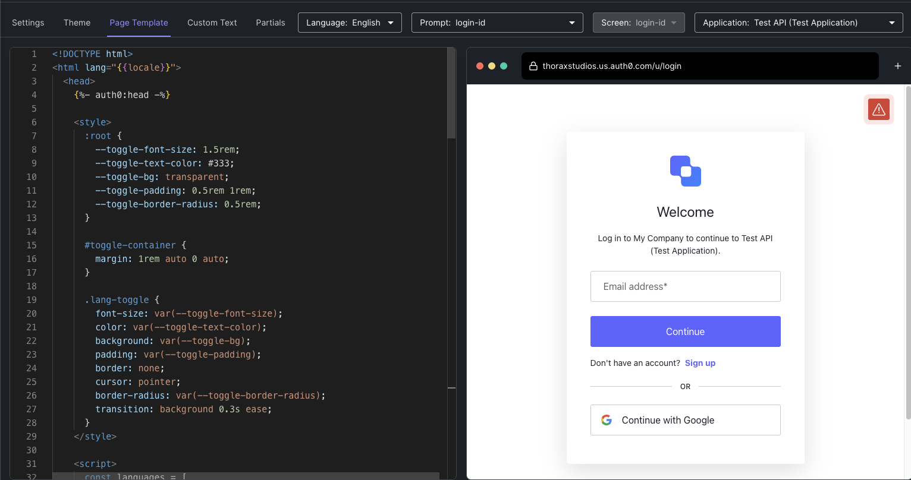
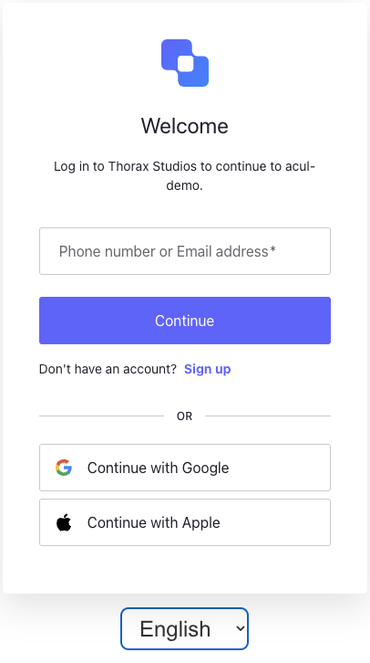

# Language Selector Support for Universal Login

## Overview

This is a simple implementation of a language selector to add to Universal Login. It is rendered
at the bottom of the Auth0 UL widget. The code references English, Italian, and Spanish, but is
easily configurable by simply adding more objects to the `languages` array.

## Prerequisites

- You must have a [custom domain](https://auth0.com/docs/customize/custom-domains) configured on your tenant.
- This project requires the [Auth0 CLI](https://github.com/auth0/auth0-cli). Ensure
  that you have logged the CLI into your desired tenant.

```bash
auth0 login
```

## Setup

1. Open the Universal Login Branding Customization Editor

   ```bash
   auth0 ul customize -r standard
   ```

2. Copy the contents of `page-template.html` into the page template.

   

3. Click `Deploy Changes!`

Or, update the page template non-interactively.

```bash
cat page-template.html | auth0 ul templates update
```

## Screenshots



## Caveats

None that I know of. Please [create an issue](https://github.com/mdwallick/ul-customization/issues) if you find one.
